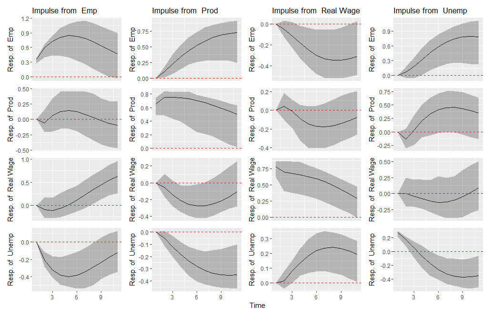

# vars2
**Vector Autoregression Models (a slightly modified version of vars)**

The R package ‘vars’, created by Bernhard Pfaff, is an extremely powerful tool for time series analysis, and his contribution is truly worthy of praise in the fields of statistics and econometrics. Numerous researchers and practitioners in the fields, myself included, have greatly appreciated it and owe a considerable debt to his contributions over the years.

Recently, I have observed a growing preference among researchers and practitioners for ‘tibble’ over ‘ts’, and ‘ggplot2’ over the base plot. In response to this trend, I am planning to slightly modify vars to utilize tibble and ggplot2.  Needless to say, I respect the original intent and functionality of the ‘vars’.

The modified version of vars is now being tentatively referred to as vars2. This package is currently in progress and has several incomplete parts. I welcome any suggestions or feedback for improvement

```
devtools::install_github("koiti-yano/vars2")
```

# New Features of vars2
+ Tibbles
+ Plot impulse response with ggplot2 (See the figure below)


# Koiti' note
Koiti's note (2024-04-09): After reaching out with the intention to fork ‘vars’, I received a generous and kind response from Dr. Bernhard Pfaff. I would like to express my gratitude for his significant contributions to the creation of many R packages, including ‘vars’, and I hereby record my appreciation for his great work.
